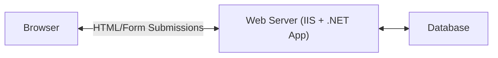

# System Design Fundamentals

## Client-Server Architecture

A computing model where tasks are distributed between clients (requesters) and
servers (providers of resources/services).

---

### **Core Components**

#### Client

End-user devices or applications that request and consume services from servers.

### this is a new change

#### Server

Dedicated computers or software that provide services, resources, or data to
clients upon request.

### **Application Layers**

#### Frontend

The client-side part of an application that users interact with directly in
their browsers.

#### Backend

The server-side part of an application responsible for data processing, business
logic, and database operations.

#### Browser/Frontend App

Applications that run in the web browser using HTML, CSS, and JavaScript.

#### Backend App

Server-side applications that handle business logic, data processing, and
database operations.

### **Application Types**

#### Single Page Application (SPA)

Web applications that load a single HTML page and dynamically update content
without full page reloads.

#### Progressive Web Application

Web applications with additional features like offline functionality, push
notifications, and device hardware access.

#### Traditional Web Application (Server-Rendered)

Applications where pages are fully rendered on the server before being sent to
the client.

### **Architecture Patterns**

#### Single-Tier Architecture

System where all application components (presentation, logic, data) reside on a
single server or client machine.

#### Multi-Tier Architecture

System design that separates functionality into multiple layers (presentation,
logic, data), typically 3-tier or n-tier.

#### Microservices Architecture

Application structure composed of small, independent services that communicate
via APIs.

## Server Infrastructure

---

### **Infrastructure Components**

#### Web Server

Software or hardware that serves content to clients via HTTP, processing
requests and delivering responses.

#### Reverse Proxy

Server that sits between clients and backend servers, forwarding client requests
to appropriate backend services.

#### Load Balancer

System that distributes incoming network traffic across multiple servers to
ensure reliability and optimal resource usage.

#### API Gateway

Service that acts as an entry point for multiple APIs, handling routing,
authentication, and other cross-cutting concerns.

#### CDN (Content Delivery Network)

Distributed network of servers that deliver web content to users based on their
geographic location.

## Networking & Communication

---

### **Network Addressing**

#### IP Address

Numerical label assigned to devices on a network, used to identify and locate
them for communication.

#### DNS (Domain Name System)

System that translates human-readable domain names into IP addresses computers
use to identify each other.

### **Communication Protocols**

#### TCP

#### HTTP/HTTPS

Protocols for transmitting web content; HTTPS adds encryption for secure data
transfer.

#### TLS/SSL

Cryptographic protocols that provide secure communication over a computer
network, commonly used in HTTPS.

#### WebSockets

Communication protocol that provides full-duplex communication channels over a
single TCP connection.

### **Performance Metrics**

#### Latency

The time delay between a request being sent and the response being received,
often measured in milliseconds.

## API Development & Management

---

### **API Architecture**

#### REST API

Architectural style for designing networked applications using HTTP methods and
stateless operations.

#### GraphQL

Query language and runtime for APIs that allows clients to request exactly the
data they need.

#### gRPC

High-performance, open-source universal RPC framework using Protocol Buffers.

### **API Communication Mechanisms**

#### Polling

#### Long Polling

#### Webhooks

HTTP callbacks that deliver data to other applications in real-time when
specific events occur.

#### Circuit Breaker

### **API Reliability & Protection**

#### Rate Limiting

Strategy to restrict the number of API requests a user can make within a
specified time period.

#### Throttling

#### Idempotency

Property where multiple identical requests have the same effect as a single
request.

#### Backoff Strategies

## Database & Storage

---

### **Database Types**

#### SQL Database

Relational database that uses structured query language for defining and
manipulating data.

#### NoSQL Database

Non-relational database designed for distributed data stores with diverse data
models.

#### TSDB (Time Series Database)

### **Data Partition**

#### Partitioning (Vertical Partitioning)

Division of a database table into multiple tables by columns, with each table
having fewer columns.

#### Sharding (Horizontal Partitioning)

Database architecture pattern where rows of a database table are held separately
in different database nodes.

### **Database Optimization**

#### Database Indexing

Data structure technique to improve the speed of data retrieval operations.

#### Denormalization

Strategy to improve read performance by adding redundant data or grouping data.

### **Storage Solutions**

#### Blob Storage

System for storing large binary objects, such as images, videos, or documents.

## Scalability & Performance

---

### **Scaling Strategies**

#### Vertical Scaling

Increasing the capacity of a single server by adding more resources (CPU, RAM).

#### Horizontal Scaling

Adding more machines to a system to handle increased load, distributing
processing across multiple servers.

### **Performance Optimization**

#### Replication

Process of creating and maintaining duplicate copies of data across multiple
nodes.

#### Caching

Temporary storage of copies of data to reduce retrieval time and server load.

## Reliability & Consistency

---

### **Consistency Models**

#### ACID Properties

Set of database transaction properties (Atomicity, Consistency, Isolation,
Durability) that guarantee valid transactions.

#### BASE Properties

Alternative to ACID for distributed systems: Basically Available, Soft state,
Eventually consistent.

#### CAP Theorem

States that distributed systems can provide at most two of three guarantees:
Consistency, Availability, and Partition tolerance.

### **Reliability Patterns**

#### Failover

Backup operational mode where functions are automatically transferred to standby
system components.

## Software Architecture & Design

### **Microservices Design Patterns**

---

#### [API Gateway](#api-gateway)

#### Service Discovery

Service that acts as an entry point for multiple APIs, handling routing,
authentication, and other concerns.

#### Saga Pattern

Sequence of local transactions where each transaction updates data within a
single service.

#### [Circuit Breaker](#circuit-breaker)

Pattern that prevents cascading failures by stopping requests to failing
services.

#### Sidecar Pattern

Deploys components of an application as separate processes or containers to
provide isolation and encapsulation.

#### CQRS (Command Query Responsibility Segregation)

Pattern that separates read and write operations to optimize performance,
scalability, and security.

#### Event-Driven Architecture

Design paradigm where components communicate through events, promoting loose
coupling and scalability.

#### Strangler Pattern

A migration pattern/strategy for incrementally replacing a legacy system by gradually routing
functionality to new services.

### **Software Design Approaches (Design Methodologies)**

---

#### Domain-Driven Design (DDD)

Software development approach focusing on the core domain and domain logic.

#### Test-Driven Development (TDD)

Development process where tests are written before code implementation, guiding
the design through failing tests that are later made to pass.

#### Event Sourcing

Storing changes to application state as a sequence of events rather than just
the current state.
