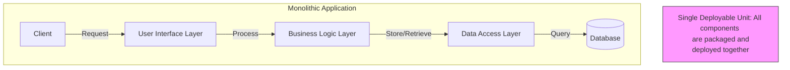
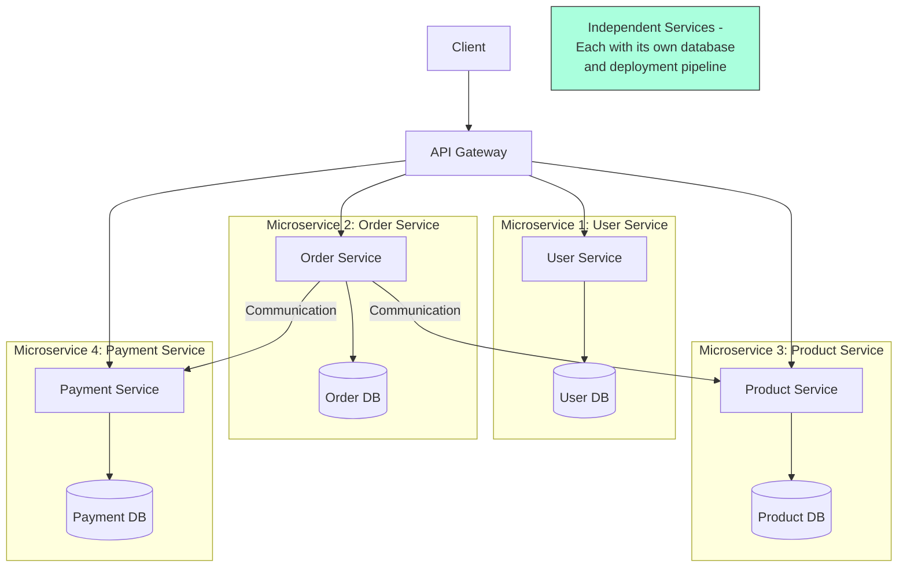
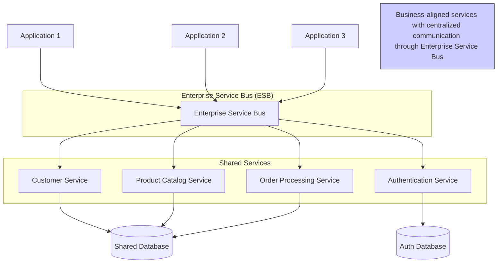

# System Design Fundamentals

## Client-Server Architecture

A computing model where tasks are distributed between clients (requesters) and
servers (providers of resources/services).

### **Core Components**

#### Client

**End-user devices or applications** that communicates with **consumer applications** to make **requests** to servers.

> Client device: Web browser, phone, computer
>
> Consumer apps: Web application, mobile application

#### Server

**Dedicated computers or software** that **provides services, resources or data** to clients over a network to **fulfill requests**.

### **Application Layers**

#### Frontend

**Web servers** that **serve staic files** (HTML, CSS, JavaScript), **routes requests** to appropriate backend servers, often **acts as the entry point** for client application.

!!! info All frontend servers are web servers, but not all web servers that serve static files are considered frontend servers (Ex: CDN, Static File Servers).

> Node.js with Express: Often used to create custom frontend servers that serve React/Angular/Vue applications
>
> Nginx as a frontend proxy: Configured specifically to route and cache frontend resources

#### Backend

**Application servers** that **host server-side applications** that process business logic, handle data operations, and interact with databases and other services.

> Examples: Application servers running Node.js, Python, Java, .NET, etc.

#### Browser/Frontend App

A **client-side application** running on the user's device that **provides the interface users interact** with directly in their browser.

> Client-side application: A collection of static files (HTML, CSS, and JavaScript)
>
> Examples: Web apps developed using frontend frameworks like React, Vue.js, Angular.

#### Backend App

**Server-side applications** (typically stateless services) that run on backend servers, **implement business logic** and **data processing** functionalities, and **expose APIs** for clients to consume.

> Examples: Applications built with ASP.NET Core, Django, Node.js

### **Application Types**

#### Traditional Web Application (Server-Rendered)

**Web applications** where **pages are fully rendered on the server** before being sent to the client.

#### Single Page Application (SPA)

**Web applications** that **load a single HTML page** and dynamically update content
without full page reloads.

> SPAs use AJAX and JavaScript to fetch data from servers and modify the current page.

#### Progressive Web Application (PWA)

**Web applications** that use modern web technologies to **deliver app-like experiences** to users.

> PWAs are responsive, work offline, can be installed on home screens, support push notifications, and combine the best features of web and mobile applications.

### **Deployment Architecture Patterns**

#### Single-Tier Architecture

A deployment strategy where **all application components (presentation, logic, data) run on a single server**. All components share the same computing resources and system environment.

#### Multi-Tier Architecture

A deployment strategy that **splits application components across multiple servers** by deploying them into separate tiers for web servers, application servers, and database servers to improves scalability, enhances maintainability, and strengthens security.

#### Containerized Architecture

A deployment strategy **using containerization (Docker, etc.) to package application components with their dependencies**. This enables consistent deployment across different environments and works with orchestration platforms like Kubernetes.

> Tools like Docker help create containers, while systems like Kubernetes help manage many containers.

## Server Infrastructure

### **Infrastructure Components**

#### Web Server

A server with specialized software that **handles HTTP requests** from clients (typically browsers). It directly **serves static content** (HTML, CSS, JavaScript, images), **forwards requests** for dynamic content to backend servers for processing, and **returns appropriate responses** to the client.

!!! info "Primary Function"

    Focus on **serving web content**, **handling HTTP protocols**, and **routing requests**

> Examples: IIS, Nginx, Apache HTTP Server

#### Reverse Proxy

A server with a specialized software that sits between client devices and backend servers, **intercepting client requests** and **forwarding them to appropriate backend servers** while providing security, SSL termination, and caching.

!!! info "Primary Function"

    Focus on request **forwarding**, **content caching**, and **security**

> Examples: Nginx, IIS with Application Request Routing (ARR), Apache with mod_proxy

#### Load Balancer

A server with a specialized software that **distributes incoming client requests across multiple servers** to ensure high availability, avoid traffic overload, prevent single points of failure, and enable horizontal scaling.

!!! info "Primary Function"

    Focus on **traffic distribution** and **high availability**

> Examples:
> &nbsp;> Load Balancing Software: Microsoft Network Load Balancing (NLB), Nginx, HAProxy,
> &nbsp;> Cloud-based Services: AWS Elastic Load Balancing, Azure Load Balancer

#### API Gateway

A server with specialized software that **acts as a single entry point** for client applications to access multiple backend services and APIs. It **serves as a reverse proxy for API requests** while providing additional functionality such as request routing, authentication, and monitoring.

!!! info "Primary Function"

    Focus on **API traffic management**, **security**, and **request coordination** cross multiple services

> Examples:
> &nbsp;> Cloud-based Services: Azure API Management, Amazon API Gateway
> &nbsp;> Software: Kong, Apigee, Tyk

#### CDN (Content Delivery Network)

**A distributed network of servers** that caches and delivers web content from the server closest to users, improving performance and user experience.

!!! Note

    Distributed globally to optimize content delivery

> Examples: CloudFlare, Akamai, Fastly.

## Networking & Communication

### **Network Addressing**

#### IP Address

Numerical label assigned to devices on a network, used to identify and locate
them for communication.

#### DNS (Domain Name System)

System that translates human-readable domain names into IP addresses computers
use to identify each other.

### **Communication Protocols**

#### TCP

#### HTTP/HTTPS

Protocols for transmitting web content; HTTPS adds encryption for secure data
transfer.

#### TLS/SSL

Cryptographic protocols that provide secure communication over a computer
network, commonly used in HTTPS.

#### WebSockets

Communication protocol that provides full-duplex communication channels over a
single TCP connection.

### **Performance Metrics**

#### Latency

The time delay between a request being sent and the response being received,
often measured in milliseconds.

## API Development & Management

### **API Architecture**

#### REST API

Architectural style for designing networked applications using HTTP methods and
stateless operations.

#### GraphQL

Query language and runtime for APIs that allows clients to request exactly the
data they need.

#### gRPC

High-performance, open-source universal RPC framework using Protocol Buffers.

### **API Communication Mechanisms**

#### Polling

#### Long Polling

#### Webhooks

HTTP callbacks that deliver data to other applications in real-time when
specific events occur.

#### Circuit Breaker

### **API Reliability & Protection**

#### Rate Limiting

Strategy to restrict the number of API requests a user can make within a
specified time period.

#### Throttling

#### Idempotency

Property where multiple identical requests have the same effect as a single
request.

#### Backoff Strategies

## Database & Storage

### **Database Types**

#### SQL Database

Relational database that uses structured query language for defining and
manipulating data.

#### NoSQL Database

Non-relational database designed for distributed data stores with diverse data
models.

#### TSDB (Time Series Database)

### **Data Partition**

#### Partitioning (Vertical Partitioning)

Division of a database table into multiple tables by columns, with each table
having fewer columns.

#### Sharding (Horizontal Partitioning)

Database architecture pattern where rows of a database table are held separately
in different database nodes.

### **Database Optimization**

#### Database Indexing

Data structure technique to improve the speed of data retrieval operations.

#### Denormalization

Strategy to improve read performance by adding redundant data or grouping data.

### **Storage Solutions**

#### Blob Storage

System for storing large binary objects, such as images, videos, or documents.

## Scalability & Performance

### **Scaling Strategies**

#### Vertical Scaling

Increasing the capacity of a single server by adding more resources (CPU, RAM).

#### Horizontal Scaling

Adding more machines to a system to handle increased load, distributing
processing across multiple servers.

### **Performance Optimization**

#### Replication

Process of creating and maintaining duplicate copies of data across multiple
nodes.

#### Caching

Temporary storage of copies of data to reduce retrieval time and server load.

## Reliability & Consistency

### **Consistency Models**

#### ACID Properties

Set of database transaction properties (Atomicity, Consistency, Isolation,
Durability) that guarantee valid transactions.

#### BASE Properties

Alternative to ACID for distributed systems: Basically Available, Soft state,
Eventually consistent.

#### CAP Theorem

States that distributed systems can provide at most two of three guarantees:
Consistency, Availability, and Partition tolerance.

### **Reliability Patterns**

#### Failover

Backup operational mode where functions are automatically transferred to standby
system components.

## Software Architecture & Design

### Software Architecture Patterns

#### Monolithic Architecture

A software design pattern where **an application is built as a single, unified codebase** with tightly coupled components (user interface, business logic, data access).

> Pros: Simplicity, easier to debug, faster initial development
>
> Cons: Harder to scale, can become complex and hard to maintain

#### Microservices Architecture

A software design pattern where **an application is built as a collection of small, independent services that communicate over a network**. Each microservice focuses on a specific business function and maintains its own data.

> Pros: Independent scaling, technology flexibility, easier for team collaboration
>
> Cons: Complex to set up and manage, harder to test end-to-end, data consistency challenges

#### Service-Oriented Architecture (SOA)

A software design pattern that **focuses on building reusable services to serve multiple applications across an entire organization**. These services typically communicate through standardized interfaces or an ESB (Enterprise Service Bus), enabling different applications to use these services regardless of the underlying technologies.

> Pros: Reusable services, business-aligned modularity, can integrate legacy systems
>
> Cons: Complex to manage, centralized ESB can become a performance bottleneck and single point of failure

### **Microservices Design Patterns**

#### [API Gateway](#api-gateway)

#### Service Discovery

Service that acts as an entry point for multiple APIs, handling routing,
authentication, and other concerns.

#### Saga Pattern

Sequence of local transactions where each transaction updates data within a
single service.

#### [Circuit Breaker](#circuit-breaker)

Pattern that prevents cascading failures by stopping requests to failing
services.

#### Sidecar Pattern

Deploys components of an application as separate processes or containers to
provide isolation and encapsulation.

#### CQRS (Command Query Responsibility Segregation)

Pattern that separates read and write operations to optimize performance,
scalability, and security.

#### Event-Driven Architecture

Design paradigm where components communicate through events, promoting loose
coupling and scalability.

#### Strangler Pattern

A migration pattern/strategy for incrementally replacing a legacy system by gradually routing
functionality to new services.

### **Software Design Approaches (Design Methodologies)**

#### Domain-Driven Design (DDD)

Software development approach focusing on the core domain and domain logic.

#### Test-Driven Development (TDD)

Development process where tests are written before code implementation, guiding
the design through failing tests that are later made to pass.

#### Event Sourcing

Storing changes to application state as a sequence of events rather than just
the current state.
