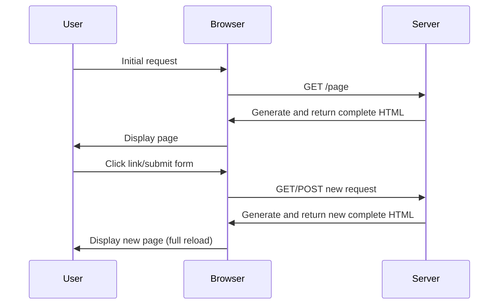
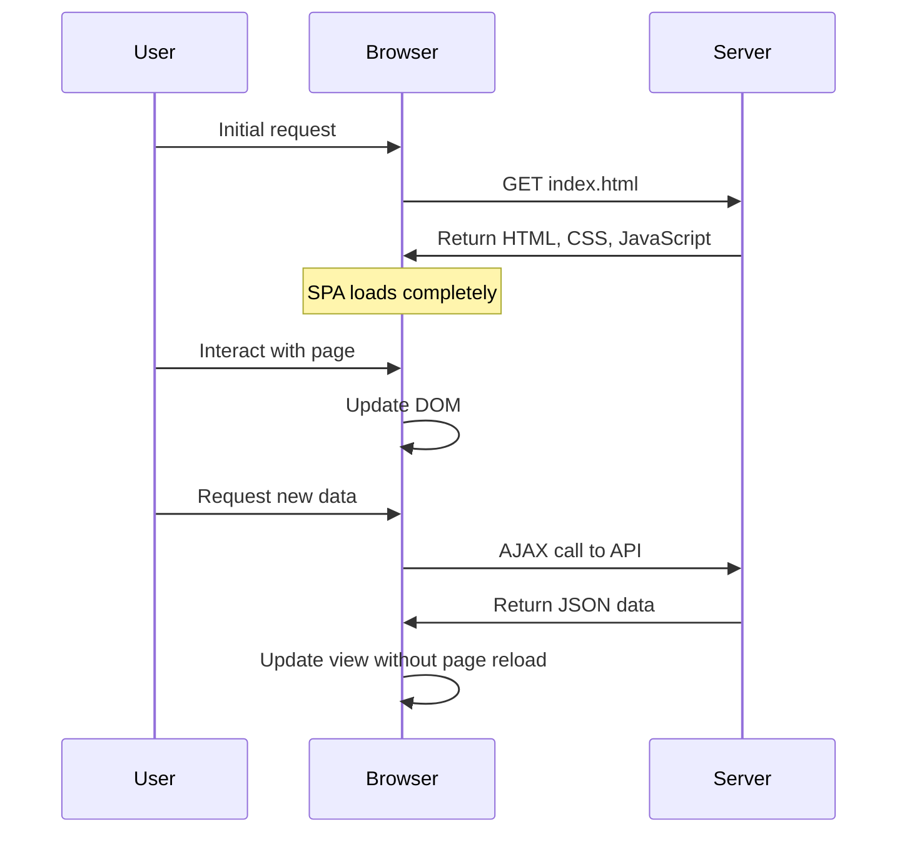
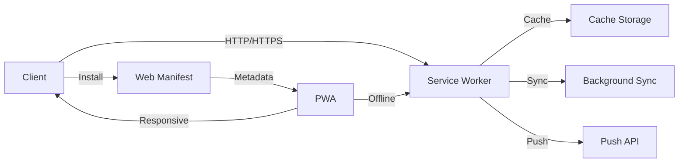
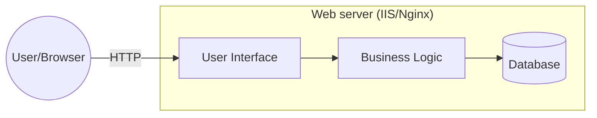
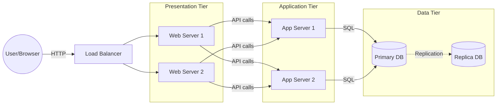
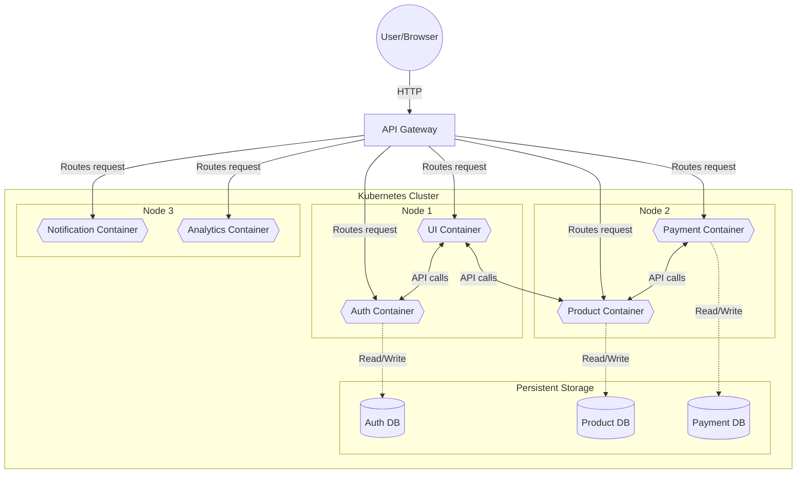

# Client-Server Architecture

A computing model where tasks are distributed between clients (requesters) and
servers (providers of resources/services).

## Core Components

### Client

**End-user (client) devices or applications** that communicates with **consumer applications** to make **requests** to servers.

!!! example "Examples"

    -   **Client devices**: Web browser, phone, computer
    -   **Consumer apps**: Web application, mobile application

### Server

**Dedicated computers or software** that **provides services, resources or data** to clients over a network to **fulfill requests**.

!!! info "Key Characteristics"

    -   Always-on availability
    -   Scalable resources
    -   Centralized management
    -   Secure access control

!!! note annotate

    Servers can be deployed in various ways depending on the requirements.(1)

1. See [Server Infrastructure](../fundamentals/server-infrastructure.md#server-deployment-models) for information about different deployment models (physical, virtual, containerized, cloud-based)

## Application Layers

### Frontend

**Web servers** that **serve static files** (HTML, CSS, JavaScript), **routes requests** to appropriate backend servers, often **acts as the entry point** for client application.

!!! info "Important Note"

    All frontend servers are [web servers](../fundamentals/server-infrastructure.md#web-server), but not all web servers that serve static files are considered frontend servers (Ex: CDN, Static File Servers).

!!! example "Examples"

    -   **Node.js with Express**: Often used to create custom frontend servers that serve React/Angular/Vue applications
    -   **Nginx as a frontend proxy**: Configured specifically to route and cache frontend resources

### Backend

**Application servers** that **host server-side applications** that process business logic, handle data operations, and interact with databases and other services.

!!! example "Examples"

    -   Application servers running Node.js, Python, Java, .NET, etc.

### Browser/Frontend App

A **client-side application** (1) running on the user's device that **provides the interface users interact** with directly in their browser.
{ .annotate }

1. client-side application: A collection of static files (HTML, CSS, and JavaScript)

!!! example "Examples"

    -   **Examples**: Web apps developed using frontend frameworks like React, Vue.js, Angular

### Backend App

**Server-side applications** (typically stateless services) that run on backend servers, **implement business logic** and **data processing** functionalities, and **expose APIs** for clients to consume.

!!! example "Examples"

    -   Applications built with ASP.NET Core, Django, Node.js

## Application Types

### Traditional Web Application

**Web applications** where **pages are fully rendered on the server** before being sent to the client.

### Single Page Application (SPA)

**Web applications** that **load a single HTML page** and dynamically update content
without full page reloads.

!!! tip

    SPAs use AJAX and JavaScript to fetch data from servers and modify the current page without requiring full page reloads.

### Progressive Web Application (PWA)

**Web applications** that use modern web technologies to **deliver app-like experiences** to users.

!!! note "Key Features"

    PWAs are responsive, work offline, can be installed on home screens, support push notifications, and combine the best features of web and mobile applications.

## Deployment Architecture Patterns

### Single-Tier Architecture

A deployment strategy where **all application components (presentation, logic, data) run on a single server**. All components share the same computing resources and system environment.

### Multi-Tier Architecture

A deployment strategy that **splits application components across multiple servers** by deploying them into separate tiers for web servers, application servers, and database servers to improves scalability, enhances maintainability, and strengthens security.

### Containerized Architecture

A deployment strategy **using containerization (Docker, etc.) to package application components with their dependencies**. This enables consistent deployment across different environments and works with orchestration platforms like Kubernetes.

!!! tip

    Tools like Docker help create containers, while systems like Kubernetes help manage many containers.
