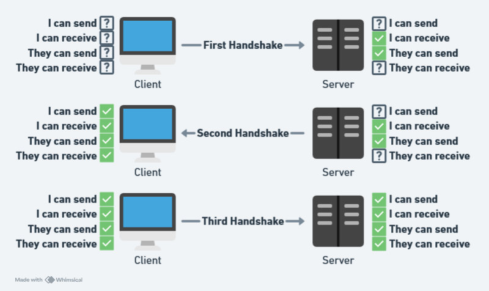
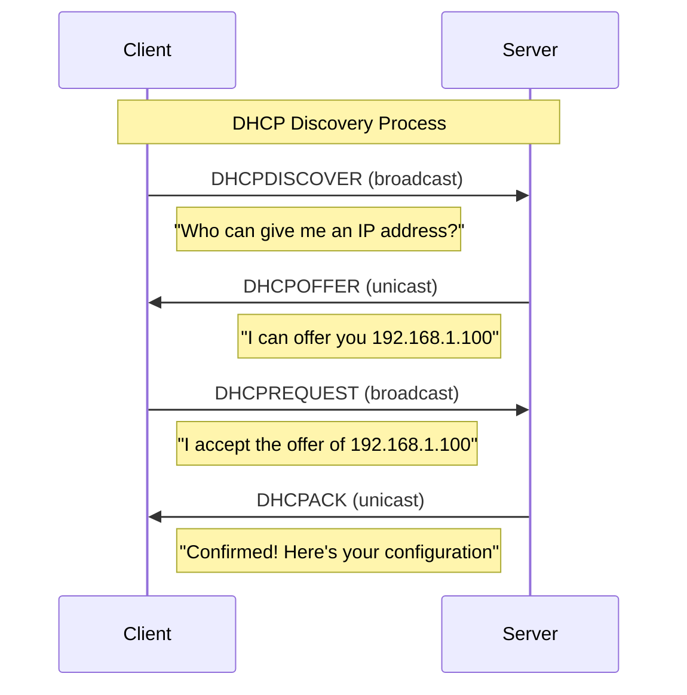

# Networking & Communication

## Network Models

Describes how computer networks are organized and how their components interact.

=== "TCP/IP Model"

    **TCP/IP (Transmission Control Protocol/Internet Protocol)** model is a conceptual and practical framework that organizes network communications into four layers:

    !!! info annotate "Layers"

        - **Application Layer**(1): Where applications and services operate (HTTP, FTP, SMTP)
        - **Transport Layer**(2): Handles data transmission between hosts (TCP, UDP)
        - **Internet Layer**(3): Manages addressing and routing of data packets
        - **Network Access/Link Layer**(4): Handles physical connection to the network (Ethernet, WiFi)

    1. End-user services
    2. End-to-end data delivery
    3. Routing packets across networks
    4. Network interface

=== "OSI Model"

    **OSI (Open Systems Interconnection) model** is another conceptual framework that describes and breaks down network communication in seven layers:

    !!! info "Layers"

        - **Application Layer (L7)**: User interface and services (HTTP, HTTPS, FTP, SMTP, DNS)
        - **Presentation Layer (L6)**: Data translation, encryption, compression (SSL/TLS, JPEG, MPEG)
        - **Session Layer (L5)**: Connection management and synchronization (NetBIOS, RPC)
        - **Transport Layer (L4)**: End-to-end communication and error recovery (TCP, UDP)
        - **Network Layer (L3)**: Logical addressing and routing (IP, ICMP, OSPF)
        - **Data Link Layer (L2)**: Physical addressing and error detection (Ethernet, MAC, PPP)
        - **Physical Layer (L1)**: Physical transmission of raw bits (Cables, Hubs, Repeaters)

!!! tip "Common Protocols"

    - **Web**: HTTP/HTTPS (Application)
    - **Email**: SMTP (Application)
    - **File Transfer**: FTP (Application)
    - **Reliable Data**: TCP (Transport)
    - **Fast Data**: UDP (Transport)
    - **Routing**: IP (Network)

## Network Addressing & Identification

### IP Addressing

Numerical label assigned to devices on a network using the Internet Protocol (IP), used to identify and locate them for communication.

#### IPv4 and IPv6

IPv4 and IPv6 are two versions of the Internet Protocol (IP) used to identify devices on a network.

!!! Note "IPv4 Key Characteristics"

    -   32-bit address format (4 bytes): Provides over 4.3 billion unique addresses (2^32)
    -   Dotted decimal notation: Addresses written as four 8-bit numbers separated by dots (e.g., 192.168.1.1), divided into network and host portions
    -   Address classes: Traditionally divided into classes A, B, C, D, and E (though modern networks use CIDR instead)
    -   Limited supply: The finite address space has led to IPv4 address exhaustion
    -   NAT dependency: Network Address Translation became necessary to extend the usable life of IPv4

!!! Note "IPv6 Key Characteristics"

    -   128-bit address format (16 bytes): Provides virtually unlimited addresses (2^128) to solve IPv4 address exhaustion
    -   Hexadecimal notation: Addresses written as eight 16-bit groups separated by colons (e.g., 2001:0db8:85a3:0000:0000:8a2e:0370:7334)
    -   Built-in security: Integrated IPsec support for authentication and encryption
    -   Auto-configuration: Supports stateless address auto-configuration (SLAAC)
    -   No NAT requirement: Designed to provide direct end-to-end connectivity without address translation

#### Subnets and CIDR notation

**Subnets** and **CIDR notation** is about **how networks are segmented**.
A **subnet** is a logical partition to divide a large network into smaller netowkr segments for improved security and performance, while **CIDR notation** uses format `IP_address/prefix_length` to represent subnet masks in IP addresses (e.g., 192.168.1.0/24).

!!! example

    **192.168.1.0/24**

    - 192.168.1.0 is the network address and /24 is the subnet mask
    - Subnet mask 24 means the first 24 bits are used for network identification, while the remaining 8 bits are used for host identification within the network
    - Contains 254 usable addresses (192.168.1.1 to 192.168.1.254)

#### Public vs Private addresses

**Public IP addresses** are globally routable and unique across the internet.

**Private IP addresses** (10.x.x.x, 172.16-31.x.x, 192.168.x.x) are used within local networks and cannot be accessed directly from the internet without NAT (Network Address Translation).

!!! Note

    - Every device has to have an IP address for communication purposes.
    - Public IP address is unique and assigned by Internet Service Provides to give you access to the World Wide Web.
    - Private IP address is only used internally (Home, business, etc) and needs to be conveted to public IP address to access the internet.

#### Loopback addresses

**127.0.0.1 (IPv4)** and **::1 (IPv6)** are **localhost** IP addresses for local development.

Special addresses (**127.0.0.1** in IPv4 and **::1** in IPv6) that allow device to send network packets to itself. Essential for testing network services locally without using the physical network interface.

### DNS (Domain Name System)

A system that translates domain names into IP addresses computers use to identify each other.

!!! example

    - When you enter "example.com" in a browser, DNS resolves this to an IP address like 93.184.216.34

!!! info "Common Record Types"

    - **A Record**: Maps hostname to IPv4 address
    - **CNAME**: Canonical name record (alias)
    - **MX**: Mail exchange record
    - **TXT**: Text record, often used for verification

#### Resolution process

DNS resolution typically involves multiple steps to find the IP address for the domain.

!!! info "How does it work"

    1. Browser first checks local DNS cache
    2. If not found, it queries a recursive DNS resolver (Provided by ISP)
    3. Resolver queries root servers, TLD nameservers, authoritative nameservers to find the IP address for the domain
    4. Caches the response and return the IP address to client

    This process is often cached at various levels to improve performance, based on the TTL.

*[Resolution process]: How your computer converts a human-friendly domain name (like "example.com")

#### TTL and propagation

TTL is a value assigned to each DNS record that determines how long that record can be cached before they must be refreshed.

DNS propagation refers to the time required for updated DNS records to spread across all DNS servers globally, which can take from minutes to 48 hours depending on TTL settings.

!!! note annotate "DNS propagation"

    When you make DNS changes (like pointing your domain to a different server), the updates won't be fully propagated until the TTL expires. (1)

1. :notepad_spiral: When planning major DNS changes (like changing web hosts), it's common practice to:
    1. Lower your TTL values to something small (like 300 seconds/5 minutes) a day or two before the change
    2. Make the DNS change
    3. Wait for the short TTL to expire globally
    4. Then increase the TTL back to a longer value (like 3600 or 86400 seconds)

#### Local host files

Operating systems maintain a **hosts file** (1) that maps hostnames to IP addresses locally, bypassing DNS resolution. This file can be modified for testing, development, or blocking specific websites, and takes precedence over DNS lookups.
{ .annotate }

1. `/etc/hosts` on Linux/Mac or `C:\Windows\System32\drivers\etc\hosts` on Windows

### Port Numbers

Logical endpoints for network communication that help computers distinguish between different services or applications running on the same IP address. (1)
{ .annotate }

1. Think of an **IP address** as the address of a building, while **port numbers** identify specific rooms or offices within that building.

!!! example "Common Ports"

    - **Web server (80/443)**: 192.168.1.10:80 (HTTP) or 192.168.1.10:443 (HTTPS)
    - **FTP server (21)**: 64.233.160.0:21
    - **SSH connection (22)**: 52.45.187.132:22
    - **SMTP mail server (25)**: smtp.example.com:25 (same as 192.168.2.5:25)
    - **DNS server (53)**: 8.8.8.8:53 (Google's DNS)
    - **Remote desktop (3389)**: 10.10.5.12:3389 (RDP)
    - **MySQL database (3306)**: 10.0.0.5:3306
    - **PostgreSQL server (5432)**: 172.16.254.1:5432
    - **MongoDB instance (27017)**: 192.168.0.100:27017

### Socket

A two-way communication endpoint that allows programs to exchange data over the network. A socket is bound to a port number so that the TCP layer can identify the application that data is destined to be sent to.

!!! tip

    A **socket address** is the combination of **IP address** and **port number**: 192.168.1.5:80

!!! info "So How Does It Work Exacly?"

    A typical example will be when you're using a web browser to visit a website:

    1. **Application Initiates Connection**: When you type "www.example.com" in your browser, your browser (the client) needs to create a network connection.
    2. **Socket Creation**: Your browser creates a socket - think of this as opening a communcation channel
    3. **Client Port Assignment**: Your OS automatically assigns your browser a random high-numbered port (like 49152-65535) as the source port.
    4. **DNS Resolution**: Your computer figures out the IP address for "example.com".
    5. **Connection Establishment**: Your browser uses its socket (Your IP address + Source Port) to connect to the web server at example.com on port 80/443 (standard HTTP/HTTPS port).
    6. **On the Server Side**: The web server at "example.com" already has a socket bound to port 80/443, activaly listening for incoming connections.
    7. **Data Exchange**: Your browser sends an HTTP request for the webpage, and the server sends back the content.
    8. **Connection Termination**: After receiving the webpage, the connection might be kept open for a while or closed, depending on settings.

    !!! note annotate "Port Biding"

        For client applications:

           - Typically don't bind to a specific port explictly
           - The OS assigns them a random port during socket creation process

        For server applications (1):

           - Explicitly bind to a specific, well-known port (like port 80 for HTTP or 443 for HTTPS) 
           - Choice of port depends on the type of application so the clients know where to connect
  
    1. :information_source: For web applications: Actually the **web server (like Apache, Nginx, or IIS)** binds to port 80, not the individual web applications. When requests come in, the web server routes them to different applications.

#### Socket Types and States

!!! info "Socket Types"

    === "Stream Socket"

        Connection-oriented sockets that use TCP for reliable, sequenced communication.
            
        Example: Web servers, file transfers, where data integrity is crucial

    === "Datagram Socket"

        Connectionless sockets that use UDP and don't guarantee reliable delivery.
            
        Example: DNS queries, streaming video, online gaming, where speed is more important

!!! info "Socket States"

    Socket states can be defined as the different phases a network socket goes through during its lifecycle.

    === "Stream Socket States (TCP-Specific)"

        TCP sockets follow a [complex state]() transition diagram throughout their connection lifecycle.


    === "Datagram Socket States (UDP-Specific)"

        UDP sockets have a much [simpler state]() model:

        - Bound: Socket has a local address and port assigned
        - Connected: Socket filters to receive only from a specific address (not a true connection)
        - Closed: Socket is no longer valid for communication

### Data Packet

A unit of data that is transferred over a network. Data sent over network is divided into packets, they are then reassembed by the device that received them.

#### Headers and encapsulation

**Encapsulation** is the process of wrapping data chunks in layers of **headers** as it moves down the protocol stack.

**Headers** are the information (protocol, source address, destination address,etc) added to the packet.

!!! note annotate

    If the orginal data is too large to  fit into a single packet, the data will be divided into multiple smaller chuncks. (1) Each of these chuncks will then go through the encapsulation process to become a data packet.

    !!! info "How does it work?"

        When you send information across a network:

        1. The original data (like text from a webpage) starts as raw content.
        2. The transport layer (TCP) divides large data into appropriate segments if needed
        3. As this data moves down through the network protocol stack, each layer adds its own header information (encapsulation):
           - The application layer might format it as HTTP
           - The transport layer (TCP/UDP) adds port information and sequence numbers
           - The network layer (IP) adds source and destination IP addresses
           - The link layer adds MAC addresses
        4. After complete encapsulation, if the packet exceeds the network's MTU, IP fragmentation occurs.

1. This division typically happens at different layers: At the **transport layer** (TCP), large data is segmented into smaller pieces that fit within the Maximum Segment Size (MSS). After encapsulation, if packets are still too large, the **network layer** (IP) will perform further fragmentation.

#### MTU and Fragmentation

**MTU**: The largest packet size that can be sent over a network connection.

**Fragmentation**: When a packet is larger than the MTU, it gets split into smaller fragments:

- Each fragment gets its own set of headers
- Fragments are reassembled at the destination
- The IP header contains information to help with reassembly

!!! tip "Standard MTU Sizes"

    - Ethernet: 1500 bytes
    - Wi-Fi: 1500 bytes

!!! info "Relationship between Encapsulation and Fragmentation"

    1. **MTU Constraints**: Each network link has an MTU limit. If after encapsulation a packet exceeds this limit, fragmentation becomes necessary.

    2. **Header Overhead**: Each layer's headers (added during encapsulation) reduce the amount of space available for actual data. For example, if MTU is 1500 bytes and headers take 40 bytes, only 1460 bytes remain for data (the MSS).

    3. **Performance Impact**: Fragmentation impacts network performance because:

          - It increases overall overhead (each fragment needs its own complete headers)
          - All fragments must arrive for reassembly (if one is lost, everything must be retransmitted)
          - Reassembly requires extra processing and memory

    4. **Path MTU Discovery**: Modern networks use this technique to determine the smallest MTU along the entire path and limit packet sizes accordingly to avoid fragmentation.

## Transport Protocols

**Transport protocols** enable communication between applications across networks, handling data delivery between endpoints. They manage how data is packaged, transmitted, received, and verified.

TCP and UDP represent two fundamentally different approaches to network communication:

- TCP: Prioritizes reliability and order at the cost of speed and overhead

- UDP: Prioritizes speed and simplicity at the cost of reliability guarantees

### TCP

A connection-oriented transport protocol that provides a reliable communication channel between devices over the internet with guaranteed delivery and ordered data transmission.

#### Connection-Oriented Communication

TCP establishes a dedicated connection through *Three-way Handshake* before exchanging data and ensures all packets arrive correctly.

!!! info "Three-Way Handshake"

    A fundamental process to establish a reliable connection between a client and a server before data transmission begins. It's like a formal greeting ritual that happens in three steps:

    ```mermaid
    sequenceDiagram
        participant Client
        participant Server

        Note over Client,Server: Connection Establishment
        Client->>Server: SYN (seq=x)
        Note right of Client: Client sends SYN packet with initial sequence number
        Server->>Client: SYN-ACK (seq=y, ack=x+1)
        Note left of Server: Server acknowledges client's SYN and sends its own SYN
        Client->>Server: ACK (seq=x+1, ack=y+1)
        Note right of Client: Client acknowledges server's SYN
        Note over Client,Server: Connection Established
        
    ```

    1. **SYN**: The client initiates the connection by sending an SYN packet with client's sequence number (x)
    2. **SYNC-ACK**: The server responds with a SYN-ACK message to acknowledge the client's request and synchronize sequence numbers (server's sequence number (y) and client's sequence number + 1 (x+1))
    3. **ACK**: The client sends an ACK packet with server's sequence number + 1 (y+1) to establish the connection.

!!! question "Why Do We Need Three-Way Handshake?"

    The three-way handshake is necessary because both parties need to confirm that they can send and receive messages properly.

    <figure markdown>
        { width="650" }
        <figcaption>TCP Three-way Handshake Process</figcaption>
    </figure>

#### TCP Socket States

TCP connections go through different states throughout their lifecycle.

| State        | Description                                                                                     |
|--------------|-------------------------------------------------------------------------------------------------|
| CLOSED       | The default state when no connection exists                                                     |
| LISTEN       | The server is waiting for connection requests (only servers enter this state)                   |
| SYN_SENT     | The client has sent a SYN packet and is waiting for a response                                  |
| SYN_RECEIVED | The server has received a SYN and sent a SYN-ACK, waiting for the final ACK                     |
| ESTABLISHED  | The three-way handshake is complete and data transfer can begin                                 |
| FIN_WAIT_1   | The application has finished sending data and sent a FIN packet to start closing the connection |
| FIN_WAIT_2   | The local end has received acknowledgment of its FIN packet                                     |
| CLOSE_WAIT   | The remote end has initiated connection termination, and the local end needs to close too       |
| LAST_ACK     | The local end has sent its own FIN after receiving a FIN from the remote end                    |
| TIME_WAIT    | Waiting to ensure the remote end received the acknowledgment of its FIN                         |
| CLOSING      | Both sides initiated closing simultaneously                                                     |

!!! note "Key Characteristics"

    - Reliability: Acknowledgment and retransmission of lost packets
    - Ordered Delivery: Sequence numbers ensure correct ordering
    - Flow Control: Prevents overwhelming receiver with too much data
    - Congestion Control: Adjusts transmission rate based on network conditions
    - Error Detection: Checksum verification ensures data integrity

!!! example "Common TCP Use Cases"

    - Web browsing (HTTP/HTTPS)
    - Email (SMTP, IMAP, POP3)
    - File transfers (FTP, SFTP)
    - Remote terminal access (SSH)
    - Database connections

### UDP

A connectionless transport protocol that sends datagrams between applications without guaranteeing delivery, used for real-time applications where speed matters more than perfect reliability.

#### Connectionless Communication

UDP sends datagrams without establishing a dedicated connection, prioritizing speed over reliability.

!!! info "UDP Communication Flow"

    In contrast to TCP's connection-oriented approach, UDP operates without formal connection between endpoints:

    ```mermaid
    sequenceDiagram
        participant Client
        participant Server

        Note over Client,Server: Connectionless Communication
        Client->>Server: Datagram 1
        Client->>Server: Datagram 2
        Client->>Server: Datagram 3
        Note right of Client: Datagrams sent without waiting for acknowledgment
        Note left of Server: May arrive in any order, or not at all
        
    ```

    1. **No Handshake**: Packets are sent immediately without connection establishment
    2. **Stateless Communication**: No connection state is maintained between endpoints
    3. **Independent Packets**: Each datagram handled independently ("fire and forget")
    4. **No Order Guarantee**: Packets may arrive in a different order than sent, with no mechanism to restore sequence

#### UDP Socket States

UDP sockets have a simplified state model compared to TCP:

`Simple Lifecycle: Create → Bind → Send/Receive → Close`

| State     | Description                                                               |
|-----------|---------------------------------------------------------------------------|
| UNBOUND   | Socket created but not yet assigned to an address or port                 |
| BOUND     | Socket assigned to a local address and port, ready for communication      |
| CONNECTED | Socket filtered to receive only from a specific address (not true connection) |
| CLOSED    | Socket is no longer valid and cannot be used for communication            |

!!! note "Key Characteristics"

    - Message-Oriented: Preserves message boundaries
    - Unreliable: No guaranteed delivery or acknowledgments
    - Unordered: No sequence numbers or packet ordering
    - Lightweight: Minimal header overhead (8 bytes)
    - Broadcast/Multicast: Supports one-to-many communication patterns
    - No Flow Control: Can send at any rate regardless of receiver capacity

!!! example "Common UDP Use Cases"

    - Domain Name System (DNS)
    - Streaming media (audio/video)
    - Voice over IP (VoIP)
    - Online gaming
    - IoT sensor data
    - Network monitoring (SNMP)

### TCP vs UDP

| Feature            | TCP                             | UDP                                     |
|--------------------|---------------------------------|-----------------------------------------|
| Connection         | Connection-oriented             | Connectionless                          |
| Reliability        | Guaranteed delivery             | Best-effort delivery                    |
| Ordering           | Maintains packet order          | No ordering guarantees                  |
| Error checking     | Extensive                       | Basic checksumming                      |
| Speed              | Slower due to overhead          | Faster, minimal overhead                |
| Header size        | 20-60 bytes                     | 8 bytes                                 |
| Congestion control | Yes                             | No                                      |
| Flow control       | Yes                             | No                                      |
| Packet boundaries  | Stream-oriented (no boundaries) | Message-oriented (preserves boundaries) |
| Use cases          | Web, email, file transfer       | Streaming, gaming, DNS                  |

!!! abstract "TCP vs UDP: Stream-Oriented vs Message-Oriented"

    - **TCP**: You get a continuous flow of bytes, requiring you to add your own message boundaries
    - **UDP**: You get distinct, separate messages with natural boundaries already preserved

    !!! example "TCP (Stream-Oriented)"

        TCP works like a continuous phone call where all words flow together:

        - When you send three messages: "Hello", "How are you?", "What's new?"
        - TCP delivers them as one continuous stream: "HelloHow are you?What's new?"
        - Your app must add its own framing mechanism to know where messages begin and end
        - Like adding delimiter characters after each message: `Hello\nHow are you?\nWhat's new?\n`

    !!! example "UDP (Message-Oriented)"

        UDP works like sending separate text messages:

        - Send three messages: "Hello", "How are you?", "What's new?"
        - UDP delivers them as three separate packages, boundaries intact
        - Each message arrives independently, with clear start and end points
        - No need to add extra markers - the packaging itself separates messages

## Network Services & Infrastructure

### DHCP (Dynamic Host Configuration Protocol)

A network management protocol that automatically assigns IP addresses and other network configuration parameters to devices on a network.

#### Automatic IP configuration

DHCP enables devices to obtain network configuration automatically without manual setup, including IP address, subnet mask, default gateway, and DNS server information.

!!! info "DHCP Benefits"

    - Eliminates manual configuration errors
    - Facilitates device mobility across networks
    - Centralizes IP address management
    - Prevents IP address conflicts through centralized allocation

!!! note "DHCP Alternatives"

    - **Static IP assignment**: Manually configuring each device (common for servers)
    - **Link-local addressing**: When DHCP fails, devices can self-assign addresses (169.254.x.x in IPv4)
    - **SLAAC**: Stateless Address Autoconfiguration in IPv6 networks

#### Lease process

The DHCP lease process involves a four-step message exchange between client and server to obtain network configuration parameters for a specific time period.



!!! example "DHCP Transaction"

    1. **DHCPDISCOVER**: Client broadcasts to find available DHCP servers
    2. **DHCPOFFER**: Server offers an IP address and configuration
    3. **DHCPREQUEST**: Client requests the offered address
    4. **DHCPACK**: Server acknowledges and finalizes the lease

!!! info "Lease Renewal"

    - IP addresses are leased for a specified time period (often 24 hours)
    - Client attempts to renew at 50% of lease time (T1)
    - If renewal fails, client tries to rebind at 87.5% of lease time (T2)
    - If rebinding fails, client must restart the DHCP discovery process

### NAT (Network Address Translation)

A method that allows multiple devices on a private network to connect to the internet using a single public IP address.

#### How private networks connect to the internet

NAT maps private IP addresses to a public IP address by modifying network address information in packet headers.

!!! info "NAT Operation"

    1. **Outbound Traffic**: 
       - Device sends packet from private IP (e.g., 192.168.1.5:3333)
       - NAT router replaces source address with public IP (e.g., 203.0.113.5:5555)
       - NAT creates a translation table entry mapping the connection
       - Modified packet is forwarded to the internet

    2. **Inbound Traffic**:
       - Response comes back to public IP (203.0.113.5:5555)
       - NAT router looks up mapping in translation table
       - Destination address is changed back to private IP (192.168.1.5:3333)
       - Packet is forwarded to the internal device

!!! note "NAT Types"

    - **Source NAT (SNAT)**: Modifies source address in outgoing packets (most common)
    - **Destination NAT (DNAT)**: Modifies destination address in incoming packets (for port forwarding)
    - **Port Address Translation (PAT)**: Uses different ports to distinguish connections (also called NAPT)

#### NAT types and challenges

Different NAT implementations vary in restrictiveness, affecting connectivity for certain applications.

!!! note "NAT Classifications"

    - **Full-cone NAT**: Most permissive - any external host can send to an internal client once a connection is established
    - **Address-restricted cone**: Only allows incoming traffic from IPs that the internal host has previously sent traffic to
    - **Port-restricted cone**: Only allows incoming traffic from specific IP:port combinations that the internal host has communicated with
    - **Symmetric NAT**: Most restrictive - uses different external ports for each destination, challenging for peer-to-peer applications

!!! warning "NAT Traversal Challenges"

    - **Peer-to-peer (P2P) connections**: Difficult when both peers are behind NAT
    - **Server-client model disruption**: External hosts can't initiate connections to NAT-hidden services
    - **Protocol incompatibility**: Some protocols embed IP addresses in payload (e.g., FTP, SIP)
    - **IPv6 transition**: NAT was a short-term solution for IPv4 exhaustion

!!! tip "NAT Traversal Techniques"

    - **STUN (Session Traversal Utilities for NAT)**: Helps discover NAT type and external IP/port
    - **TURN (Traversal Using Relays around NAT)**: Uses relay server for restrictive NATs
    - **ICE (Interactive Connectivity Establishment)**: Framework combining STUN, TURN, and direct connectivity
    - **UPnP/NAT-PMP**: Protocols allowing applications to configure port forwarding automatically

### Routing

The process of selecting paths in a network along which to send network traffic.

#### Routing tables and protocols

**Routing tables** contain information about network destinations and how to reach them, while **routing protocols** are the methods by which routers share information to build these tables.

!!! example "Simplified Routing Table"

    | Destination Network | Subnet Mask     | Next Hop      | Interface | Metric |
    |---------------------|-----------------|---------------|-----------|--------|
    | 192.168.1.0         | 255.255.255.0   | 0.0.0.0       | eth0      | 0      |
    | 10.0.0.0            | 255.0.0.0       | 192.168.1.254 | eth0      | 10     |
    | 0.0.0.0             | 0.0.0.0         | 192.168.1.1   | eth0      | 1      |

!!! info "Routing Process"

    When a router receives a packet:

    1. Extract the destination IP address
    2. Look for the longest matching prefix in the routing table
    3. Forward the packet to the next hop or directly to the destination
    4. If no match is found, send to the default gateway (if configured)

#### Default gateways

A **default gateway** is the node (typically a router) that serves as an access point to other networks when no specific route matches the destination.

!!! note

    - Default route is represented as 0.0.0.0/0 in routing tables
    - It's used as a "last resort" when no more specific route exists
    - In home/office networks, the default gateway connects the local network to the internet
    - Without a default gateway, devices can only communicate within their local network

!!! example

    For a device with IP 192.168.1.100 and subnet mask 255.255.255.0:
    
    - Can directly reach addresses 192.168.1.1 through 192.168.1.254
    - Must use default gateway (typically 192.168.1.1) to reach any other address

#### Autonomous systems

An **Autonomous System (AS)** is a collection of connected IP networks under the control of a single organization that presents a common routing policy to the internet.

!!! info "AS Characteristics"

    - Identified by a unique Autonomous System Number (ASN)
    - Typically operated by ISPs or large organizations
    - Interior routing occurs within an AS (using protocols like OSPF, EIGRP)
    - Exterior routing occurs between different ASes (using BGP)
    
!!! example

    - Google's AS number is AS15169
    - Comcast uses AS7922
    - Amazon Web Services uses multiple ASNs including AS16509

#### Routing protocols: How routers learn paths (BGP, OSPF, etc.)

Routing protocols enable routers to dynamically discover and share information about network topologies.

!!! note "Interior vs. Exterior Protocols"

    === "Interior Gateway Protocols (IGP)"
    
        Used within an autonomous system:
        
        - **OSPF (Open Shortest Path First)**: Link-state protocol that calculates shortest path first using Dijkstra's algorithm
        - **IS-IS (Intermediate System to Intermediate System)**: Similar to OSPF, used in large service provider networks
        - **RIP (Routing Information Protocol)**: Simple distance-vector protocol with hop count as metric (limited to 15 hops)
        - **EIGRP (Enhanced Interior Gateway Routing Protocol)**: Cisco's advanced distance-vector protocol
    
    === "Exterior Gateway Protocols (EGP)"
    
        Used between autonomous systems:
        
        - **BGP (Border Gateway Protocol)**: The routing protocol of the internet, makes decisions based on paths, policies, and rule-sets rather than just metrics

!!! info "Routing Protocol Selection Factors"

    - Network size and complexity
    - Convergence speed requirements
    - Administrative boundaries
    - Hardware capabilities
    - Scalability needs

### Proxies & Intermediaries

Network components that mediate connections between clients and servers.

#### Forward proxies

A **forward proxy** sits between client devices and the internet, forwarding client requests to web servers.

!!! note "Forward Proxy Features"

    - Client must be configured to use the proxy
    - Can provide anonymity by hiding client's real IP address
    - Enables access control, content filtering, and usage policies
    - Can cache resources to improve performance

!!! example "Common Forward Proxy Uses"

    - Corporate networks restricting employee internet access
    - Schools filtering inappropriate content
    - Bypassing geo-restrictions (VPN services often function as proxies)
    - Anonymizing web browsing

#### Reverse proxies

A **reverse proxy** sits in front of web servers and forwards client requests to appropriate backend servers.

!!! note "Reverse Proxy Features"

    - Client interacts with the proxy believing it's the actual server
    - Distributes client requests across multiple servers
    - Provides additional security by hiding backend server details
    - Can handle SSL/TLS encryption/decryption (SSL termination)
    - Enables caching and compression of responses

!!! example "Common Reverse Proxy Uses"

    - Load balancing across multiple application servers
    - Web application firewalls
    - Content caching
    - Handling SSL/TLS termination

#### Load balancers

A **load balancer** distributes incoming network traffic across multiple servers to ensure high availability and reliability.

!!! info "Load Balancing Methods"

    - **Round Robin**: Requests distributed sequentially to each server
    - **Least Connections**: Requests sent to server with fewest active connections
    - **Least Response Time**: Requests sent to server with fastest response time
    - **IP Hash**: Client IP determines which server receives the request (session persistence)
    - **Weighted**: Servers assigned different weights based on capacity

!!! example "Load Balancer Types"

    - **Layer 4 (Transport)**: Decisions based on IP address and port
    - **Layer 7 (Application)**: Content-aware, can route based on URL, HTTP headers, cookies
    - **Hardware**: Purpose-built appliances (e.g., F5, Citrix)
    - **Software**: Applications running on standard servers (e.g., NGINX, HAProxy)
    - **Cloud-based**: Managed services (e.g., AWS ELB, Google Cloud Load Balancing)

### Firewalls & Network Security

Network security devices that monitor and filter incoming and outgoing network traffic based on security rules.

#### Traffic filtering

Firewalls filter traffic based on predefined security rules to protect networks from unauthorized access and threats.

!!! info "Firewall Filtering Criteria"

    - Source and destination IP addresses
    - Port numbers
    - Protocol types (TCP, UDP, ICMP)
    - Application-specific data (for advanced firewalls)
    - Time of day
    - User identity (in next-gen firewalls)

!!! example "Firewall Types"

    - **Packet Filtering Firewalls**: Basic firewalls examining packet headers
    - **Circuit-Level Gateways**: Monitor TCP handshakes and sessions
    - **Application-Level Gateways (Proxies)**: Inspect application-layer data
    - **Stateful Inspection Firewalls**: Track the state of active connections
    - **Next-Generation Firewalls (NGFW)**: Combine traditional firewall with additional functionality (IPS, deep packet inspection)

#### Stateful vs stateless inspection

The primary distinction between stateful and stateless firewalls is whether they track the state of active network connections.

!!! note "Stateless Inspection"

    - Examines each packet in isolation
    - Uses static rules based on source/destination addresses and ports
    - Doesn't keep track of connection state
    - Faster but less secure
    - Vulnerable to IP spoofing and certain attacks

!!! note "Stateful Inspection"

    - Tracks the state of active connections in a state table
    - Understands the context of traffic based on previous packets
    - Can determine if a packet is part of an existing connection
    - More secure but requires more resources
    - Can prevent many types of attacks by validating connection sequences

!!! example "Stateful Firewall Operation"

    1. Outbound request creates an entry in the state table
    2. Inbound responses are checked against this table
    3. Packets that match known connections are allowed
    4. Packets claiming to be responses but without matching entries are blocked

## Performance Metrics

Key measurements that help evaluate network performance and identify issues.

### Latency

The time delay between a request being sent and the response being received, often measured in milliseconds.

!!! note "Latency Components"

    - **Propagation delay**: Time for signal to travel from source to destination (limited by speed of light)
    - **Transmission delay**: Time to push all the packet's bits onto the link
    - **Processing delay**: Time spent handling the packet inside devices
    - **Queuing delay**: Time spent waiting in buffers for processing

!!! example "Typical Values"

    - **Low latency**: < 100ms
    - **Medium latency**: 100-300ms
    - **High latency**: > 300ms

!!! warning "Impact on Applications"

    - **Web browsing**: Pages load slower with high latency
    - **Real-time audio/video**: Noticeable delays in conversation
    - **Online gaming**: Character/gameplay lag
    - **Financial trading**: Missed opportunities with millisecond delays

### Throughput

The amount of data that can be transferred from one point to another in a given time period.

!!! info "Throughput vs. Bandwidth"

    - **Bandwidth** is the theoretical capacity of the connection
    - **Throughput** is the actual amount of data transferred
    - Throughput is almost always lower than bandwidth due to protocol overhead, latency, network congestion, etc.

!!! info "Common Units"

    - Kbps (Kilobits per second)
    - Mbps (Megabits per second)
    - Gbps (Gigabits per second)

!!! tip "Factors Affecting Throughput"

    - Network congestion
    - Protocol overhead
    - Device limitations
    - Application design
    - Distance and physical media
    - TCP window size

### Bandwidth

The maximum data transfer rate of a network or internet connection.

!!! info "Typical Values"

    - **Home broadband**: 25-1000 Mbps
    - **Business connections**: 100 Mbps to 10+ Gbps
    - **Data center connections**: Multiple 10/40/100 Gbps links

!!! example "Bandwidth Requirements"

    | Application | Typical Minimum Bandwidth |
    |-------------|---------------------------|
    | Web browsing | 1-5 Mbps |
    | SD video streaming | 3-5 Mbps |
    | HD video streaming | 5-10 Mbps |
    | 4K video streaming | 25-50 Mbps |
    | Video conferencing | 1-6 Mbps |
    | Online gaming | 3-25 Mbps |
    | File downloads | Varies with urgency |

### Packet Loss

Percentage of packets that fail to reach their destination.

!!! info "Causes of Packet Loss"

    - Network congestion
    - Hardware failures
    - Software bugs
    - Signal interference (wireless)
    - Oversaturated network devices
    - Security issues (firewall drops)

!!! warning "Impact"

    - **<1%**: Generally acceptable
    - **1-2.5%**: Noticeable impact on real-time applications
    - **>3%**: Significant degradation in service quality

!!! tip "Detecting Packet Loss"

    ```bash
    $ ping -c 100 example.com | grep -o -P '\d+(?=% packet loss)'
    0
    ```
    
    A value of 0 indicates no packet loss during the test.

### Jitter

Variation in the delay of received packets.

!!! info "Why Jitter Matters"

    - Creates uneven delivery of real-time data
    - Causes stuttering in voice/video
    - Affects timing-sensitive applications
    - Less important for web browsing, file transfers

!!! info "Acceptable Values"

    - **<30ms**: Good for VoIP and video calling
    - **>30ms**: May cause quality issues in real-time communications

!!! tip "Reducing Jitter Impact"

    - Jitter buffers in real-time applications
    - Quality of Service (QoS) configurations
    - Consistent network paths
    - Adequate bandwidth provision

## Network Troubleshooting

### Common diagnostic tools

Network diagnostic tools help identify and resolve connectivity, performance, and configuration issues.

!!! info "Essential Diagnostic Tools"

    - **ping**: Tests basic connectivity and measures round-trip time
    - **traceroute/tracert**: Displays the path packets take to a destination
    - **nslookup/dig**: Queries DNS servers to resolve domain names
    - **ipconfig/ifconfig**: Displays network interface configurations
    - **netstat/ss**: Shows active network connections and listening ports
    - **tcpdump/Wireshark**: Captures and analyzes network packets
    - **nmap**: Network scanning and security auditing
    - **curl/wget**: Tests HTTP/HTTPS connections and downloads
    - **iperf**: Measures network performance (bandwidth, packet loss)
    - **mtr**: Combines ping and traceroute for continuous monitoring

!!! example "Using Diagnostic Tools"

    === "Ping Example"
    
        ```bash
        $ ping example.com
        PING example.com (93.184.216.34): 56 data bytes
        64 bytes from 93.184.216.34: icmp_seq=0 ttl=56 time=11.632 ms
        64 bytes from 93.184.216.34: icmp_seq=1 ttl=56 time=11.726 ms
        64 bytes from 93.184.216.34: icmp_seq=2 ttl=56 time=10.683 ms
        ```
        
        Indicates: Successful connectivity with ~11ms latency
    
    === "Traceroute Example"
    
        ```bash
        $ traceroute example.com
        traceroute to example.com (93.184.216.34), 64 hops max
        1  router.local (192.168.1.1)  1.170 ms  0.882 ms  0.798 ms
        2  isp-gateway.net (203.0.113.1)  12.616 ms  14.714 ms  15.494 ms
        3  isp-core-1.net (198.51.100.5)  15.746 ms  17.586 ms  16.003 ms
        4  internet-backbone.net (198.51.100.25)  20.853 ms  17.538 ms  18.012 ms
        5  example-edge.net (93.184.216.1)  19.125 ms  18.741 ms  18.294 ms
        6  example.com (93.184.216.34)  22.333 ms  21.496 ms  21.146 ms
        ```
        
        Indicates: The route takes 6 hops with potential bottleneck at hop 4

### Typical network issues

Common network problems encountered in software development and system administration.

!!! warning "Common Network Issues"

    - **Connectivity failures**: Complete inability to reach a service or resource
    - **High latency**: Excessive delays in data transmission
    - **Packet loss**: Data packets never reaching their destination
    - **DNS resolution problems**: Inability to convert domain names to IP addresses
    - **Routing issues**: Inefficient or incorrect paths through the network
    - **Firewall blockages**: Security configurations preventing legitimate traffic
    - **MTU mismatches**: Packet fragmentation or black-holing
    - **Bandwidth saturation**: Network congestion causing slowdowns
    - **Authentication failures**: Issues with access credentials
    - **Certificate errors**: Problems with TLS/SSL certificates or validation

!!! example "Symptom-Cause Correlation"

    | Symptom | Potential Causes | Initial Investigation |
    |---------|------------------|----------------------|
    | Can't reach website | DNS error, connectivity issue, server down | ping IP address, check DNS resolution |
    | Intermittent connection | Packet loss, routing issues, interference | ping with flood option, check for pattern |
    | Slow performance | Latency, bandwidth limitations, server overload | Run traceroute, check bandwidth usage |
    | Connection timeouts | Firewall blocking, server not responding, misrouting | Check firewall logs, verify server status |

### Debugging approaches

Systematic methods for identifying, isolating, and resolving network problems.

!!! tip "Network Troubleshooting Methodology"

    1. **Identify the problem**: Clearly define the issue and its symptoms
    2. **Gather information**: Collect relevant data about the network environment
    3. **Analyze the OSI layers systematically**: Start from physical layer and move up
    4. **Isolate the issue**: Determine which component or segment is causing the problem
    5. **Implement a solution**: Make necessary changes to resolve the issue
    6. **Verify the fix**: Confirm the problem is resolved
    7. **Document the solution**: Record the issue and resolution for future reference

!!! note "OSI Layer Troubleshooting Approach"

    === "Physical & Data Link (L1-L2)"
    
        - Check cables, connections, interface status
        - Verify link lights, interface errors, duplex mismatches
        - Commands: `ifconfig`/`ipconfig`, `ethtool`, check hardware
    
    === "Network & Transport (L3-L4)"
    
        - Verify IP configuration, routing, and connectivity
        - Test basic connectivity and trace packet path
        - Commands: `ping`, `traceroute`, `route`, `netstat`/`ss`
    
    === "Session & Above (L5-L7)"
    
        - Check application configuration, ports, and services
        - Test specific services and application functionality
        - Commands: `telnet`, `nslookup`/`dig`, `curl`, application logs

!!! example "Divide and Conquer Approach"

    For a web application connectivity issue:
    
    1. Can the client reach anything on the internet? (Test with `ping 8.8.8.8`)
    2. Can the client resolve DNS? (Test with `nslookup example.com`)
    3. Can the client reach the web server? (Test with `ping web-server-ip`)
    4. Is the web server listening on the expected port? (Test with `telnet web-server-ip 80`)
    5. Is there an application-specific error? (Check HTTP status codes, application logs)

!!! tip "Advanced Debugging Techniques"

    - **Packet Capture Analysis**: Use Wireshark/tcpdump to inspect actual packets
    - **Network Baselining**: Compare current performance to established baselines
    - **Configuration Comparison**: Compare working vs. non-working configurations
    - **Control Environment Testing**: Test in a simplified environment to rule out variables
    - **Log Correlation**: Analyze logs from multiple devices to identify patterns
