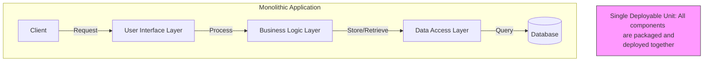
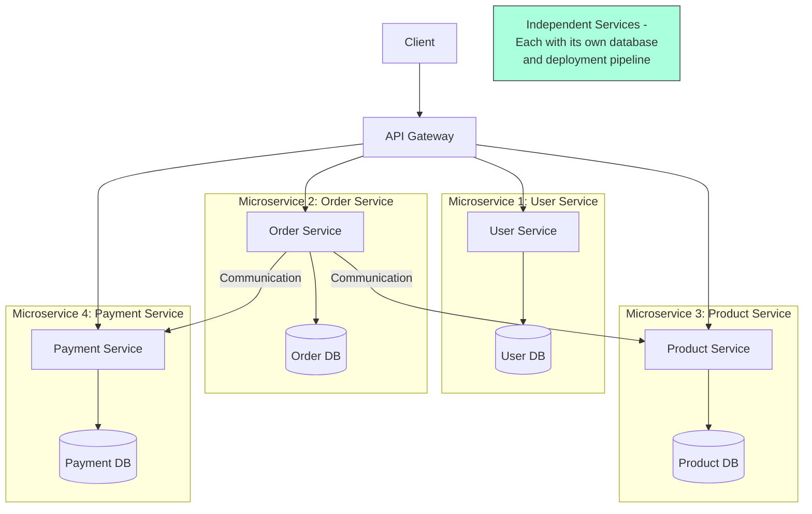
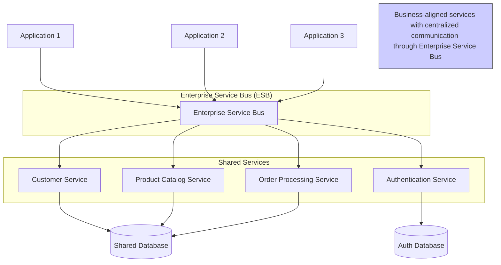

# Software Architecture & Design

## Software Architecture Patterns

### Monolithic Architecture

A software design pattern where **an application is built as a single, unified codebase** with tightly coupled components (user interface, business logic, data access).

!!! success "Pros"

    - Simplicity
    - Easier to debug
    - Faster initial development

!!! failure "Cons"

    - Harder to scale
    - Can become complex and hard to maintain
    - Team coordination challenges

### Microservices Architecture

A software design pattern where **an application is built as a collection of small, independent services that communicate over a network**. Each microservice focuses on a specific business function and maintains its own data.

!!! success "Pros"

    - Independent scaling
    - Technology flexibility
    - Easier for team collaboration
    - Fault isolation

!!! failure "Cons"

    - Complex to set up and manage
    - Harder to test end-to-end
    - Data consistency challenges
    - Network overhead

### Service-Oriented Architecture (SOA)

A software design pattern that **focuses on building reusable services to serve multiple applications across an entire organization**. These services typically communicate through standardized interfaces or an ESB (Enterprise Service Bus), enabling different applications to use these services regardless of the underlying technologies.

!!! success "Pros"

    - Reusable services
    - Business-aligned modularity
    - Can integrate legacy systems
    - Standardized interfaces

!!! failure "Cons"

    - Complex to manage
    - Centralized ESB can become a performance bottleneck and single point of failure
    - Often requires significant governance

## Microservices Design Patterns

### API Gateway

The API Gateway pattern provides a unified entry point for clients to interact with a system of microservices.

!!! tip "Implementation Considerations"

    Should handle cross-cutting concerns like authentication, logging, and request routing

### Service Discovery

Service that enables microservices to find and communicate with each other without hardcoded locations.

!!! example "Implementation Options"

    - **Client-side discovery**: Services query a registry (e.g., Netflix Eureka)
    - **Server-side discovery**: Load balancer routes requests (e.g., Kubernetes Service)

### Saga Pattern

Sequence of local transactions where each transaction updates data within a
single service.

!!! info "Coordination Methods"

    - **Choreography**: Each service publishes events that trigger other services
    - **Orchestration**: Central coordinator directs the saga steps

### Sidecar Pattern

Deploys components of an application as separate processes or containers to
provide isolation and encapsulation.

!!! example "Common Uses"

    - Service mesh proxies (Istio, Linkerd)
    - Logging agents
    - Configuration agents

### CQRS (Command Query Responsibility Segregation)

Pattern that separates read and write operations to optimize performance,
scalability, and security.

!!! tip "When to Use"

    - When read and write workloads have significantly different performance and scaling requirements

### Event-Driven Architecture

Design paradigm where components communicate through events, promoting loose
coupling and scalability.

!!! example "Implementation Technologies"

    - Kafka
    - RabbitMQ
    - AWS EventBridge
    - Azure Event Grid

### Strangler Pattern

A migration pattern/strategy for incrementally replacing a legacy system by gradually routing
functionality to new services.

!!! tip "Implementation Steps"

    1. Create a facade in front of the legacy system
    2. Gradually build new functionality behind the facade
    3. Incrementally redirect from legacy to new implementation
    4. Remove legacy code when no longer used

## Software Design Approaches

### Domain-Driven Design (DDD)

Software development approach focusing on the core domain and domain logic.

!!! info "Key Concepts"

    - Bounded contexts
    - Ubiquitous language
    - Aggregates
    - Domain events
    - Repositories

### Test-Driven Development (TDD)

Development process where tests are written before code implementation, guiding
the design through failing tests that are later made to pass.

!!! info "TDD Cycle"

    1. Write a failing test
    2. Write minimal code to pass the test
    3. Refactor while maintaining passing tests

### Event Sourcing

Storing changes to application state as a sequence of events rather than just
the current state.

!!! example "Benefits"

    - Complete audit history
    - Time travel (reconstruct past states)
    - Excellent for debugging and analysis
